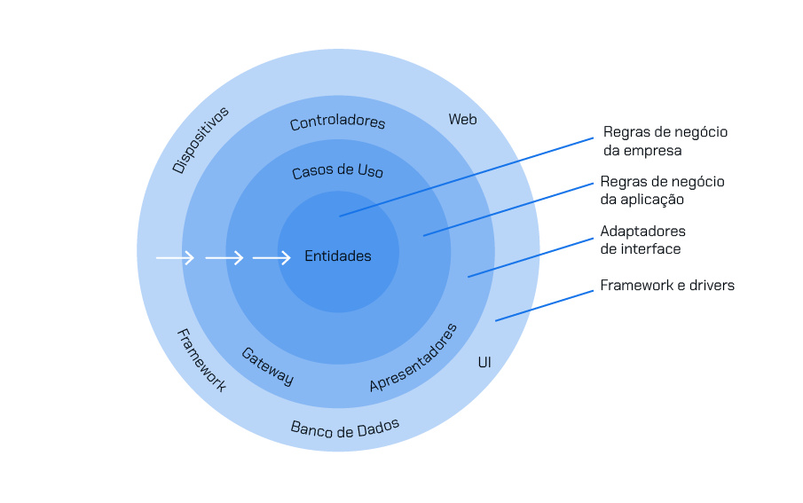

# CodeChella

App de simulação de um site para venda de ingressos de eventos diversos criado para aprender sobre o Clean Architeture.

## Clean architecture

Proposta por *Robert C. Martin*, também conhecido como "Uncle Bob", a clean architecture (literalmente arquitetura limpa em inglês) visa criar sistemas que sejam independentes de frameworks, UIs e bancos de dados. Ela define uma arquitetura em camadas, com o núcleo da aplicação contendo as regras de negócio mais importantes e as camadas externas contendo detalhes de implementação.

Seus princípios fundamentais:

- **Independência de frameworks**: o código-fonte não deve depender de nenhum framework específico. Os frameworks são ferramentas externas e voláteis que podem mudar com o tempo, então a arquitetura deve ser projetada de forma a isolar o código da aplicação dessas mudanças.
- **Independência de interface do usuário**: a lógica de negócios da aplicação não deve ser diretamente ligada à interface do usuário (UI). Isso permite que diferentes interfaces de usuário (como interfaces web, APIs REST, interfaces de linha de comando etc.) sejam facilmente conectadas à mesma lógica de negócios.
- **Independência de banco de dados**: assim como a UI, o código de acesso a dados não deve ser diretamente acoplado à lógica de negócios. Isso permite que diferentes sistemas de armazenamento de dados (como bancos de dados SQL, NoSQL, serviços de armazenamento em nuvem etc.) sejam facilmente substituídos ou alterados sem afetar a lógica de negócios.
- **Independência de políticas (ou agentes externos)**: a regra de negócios deve ser independente de detalhes de implementação, como políticas de persistência, políticas de UI- , políticas de segurança etc. Isso permite que diferentes políticas sejam facilmente alternadas ou modificadas sem alterar o núcleo da aplicação.

Com base nesses princípios, a clean architecture organiza o código em camadas concêntricas, em que o núcleo da aplicação (conhecido como "entidades de negócio" ou "domínio") é cercado por camadas que contêm detalhes de implementação, como interfaces com o usuário, acesso a dados etc. As camadas são organizadas em um formato de anéis concêntricos, com o núcleo da aplicação no centro e as camadas externas ao redor.

As camadas típicas em uma clean architecture incluem:

- **Entidades de negócio (entities)**: é a camada mais interna e contém as entidades de domínio ou objetos de negócio que representam conceitos do domínio da aplicação. As entidades de negócio encapsulam o estado e o comportamento da aplicação e são independentes de qualquer detalhe de implementação.
- **Casos de uso (use cases ou interactors)**: esta camada contém os casos de uso da aplicação, ou seja, serviços e operações que a aplicação oferece aos usuários. Os casos de uso orquestram a execução das operações de negócio, utilizando as entidades de domínio e coordenando a interação com as camadas externas.
- **Controladores, presenters e gateways**: são as camadas externas responsáveis por traduzir as entradas e saídas da interface do usuário para os casos de uso da aplicação e vice-versa. Eles adaptam os dados e os eventos entre a UI e os casos de uso, garantindo a separação de responsabilidades e a independência entre essas camadas.
- **Interfaces do usuário (UI), frameworks e drivers**: esta camada contém as interfaces com o usuário, como interfaces web, APIs REST, interfaces de linha de comando etc. Ela é responsável por receber as solicitações do usuário, apresentar informações e coletar entradas, mas não contém lógica de negócios. Esta camada também contém os detalhes de implementação específicos, como frameworks, bibliotecas e drivers. Ela inclui código para lidar com detalhes de infraestrutura, como acesso a dados, comunicação de rede etc. Esses detalhes são encapsulados e isolados das camadas internas da aplicação.

## Entity X Value Objects

No contexto da clean architecture, as entidades e objetos de valor são conceitos fundamentais que ajudam a modelar o domínio da aplicação de forma coesa e semântica. Eles desempenham papéis distintos na representação dos conceitos do domínio e na estruturação do código.

As *entidades (entities)* representam os objetos principais do domínio da aplicação. Elas têm identidade própria e são mutáveis, o que significa que as mudanças em seus atributos refletem mudanças no estado do sistema. As entidades são geralmente associadas a conceitos do domínio que têm vida útil longa e são distinguidos por suas características únicas.

Por exemplo, em um sistema de gerenciamento de biblioteca, um livro pode ser considerado uma entidade. Ele tem um ISBN (Número Padrão Internacional de Livro) que é único e permite que você identifique esse livro específico, não importa se o título ou o autor mudarem. As entidades encapsulam a lógica de negócios relacionada a si mesmas e são o cerne do modelo de domínio.

Os *objetos de valor (value objects)* representam valores que são importantes para o domínio da aplicação, mas não têm identidade própria. Eles são imutáveis, ou seja, uma vez criados, seus valores não podem ser alterados. Os objetos de valor são geralmente usados para modelar conceitos do domínio que são definidos exclusivamente por seus atributos, sem identidade distinta.

Por exemplo, um objeto de valor comum poderia ser "Endereço", que incluiria atributos como rua, cidade, estado, CEP etc. Cada instância de "Endereço" é distinta apenas pelos seus atributos e pode ser comparada com outras instâncias baseadas nesses valores.

A distinção entre entidades e objetos de valor é importante na clean architecture porque ajuda a definir limites claros entre conceitos de domínio e detalhes de implementação. As entidades encapsulam a lógica de negócios central da aplicação e representam conceitos que têm identidade própria e ciclo de vida longo. Por outro lado, os objetos de valor representam valores que são importantes para o domínio, mas não têm identidade própria e são usados principalmente para definir tipos imutáveis e semânticos.

## Use Cases

Dentro da arquitetura limpa (clean architecture), os casos de uso são definidos na camada de regras de negócio (ou use cases) da arquitetura. Essa camada é responsável por conter a lógica de negócios da aplicação, onde são implementadas as funcionalidades específicas do sistema.

Para definir bem os casos de uso dentro da arquitetura limpa, você pode seguir estas práticas:

- **Identificar os requisitos do sistema**: antes de tudo, é fundamental entender os requisitos do sistema e as necessidades dos usuários. Isso ajudará a determinar quais casos de uso precisam ser implementados.
- **Definir os casos de uso**: com base nos requisitos identificados, você pode definir os casos de uso da aplicação. Cada caso de uso deve representar uma funcionalidade ou um conjunto de funcionalidades específicas que o sistema oferece aos usuários.
- **Nomear os casos de uso de forma clara e concisa**: os nomes dos casos de uso devem ser descritivos e indicativos do que a funcionalidade faz. Isso facilitará a compreensão e a comunicação entre os membros da equipe.
- **Identificar os atores envolvidos**: para cada caso de uso, identifique os atores (usuários, sistemas externos etc.) que interagem com o sistema e quais são suas responsabilidades dentro do contexto da funcionalidade.
- **Descrever os fluxos de eventos**: para cada caso de uso, descreva os fluxos de eventos que representam as diferentes interações entre os atores e o sistema. Isso inclui os passos necessários para completar a funcionalidade, bem como os possíveis cenários de exceção.
- **Implementar os casos de uso na camada de regras de negócio**: após definir os casos de uso, você pode implementá-los na camada de regras de negócio da arquitetura limpa. Cada caso de uso deve ser uma classe ou um componente que encapsula a lógica de negócios correspondente.
- **Testar os casos de uso de forma isolada**: certifique-se de testar cada caso de uso de forma isolada para garantir que eles funcionem conforme o esperado. Isso pode ser feito utilizando testes unitários e testes de integração.
